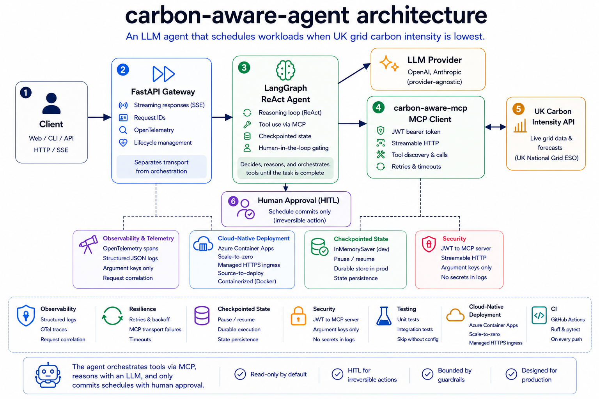

# carbon-aware-agent

v0.1.1

A LangGraph ReAct agent that uses MCP tools to schedule workloads when UK grid carbon intensity is lowest.

The agent consumes the remote `carbon-aware-mcp` service, reasons over live forecast data, and recommends the greenest time window for a job.

🔗 **Live:** https://carbon-aware-agent.happystone-b5035f44.polandcentral.azurecontainerapps.io

## Architecture



Client → FastAPI gateway → LangGraph ReAct agent → MCP tool loop → UK Carbon Intensity data

## Overview

Given a job duration and a scheduling window, the agent finds the lowest-carbon time to run the workload using live UK grid forecast data exposed through MCP tools.

```bash
curl -X POST https://carbon-aware-agent.happystone-b5035f44.polandcentral.azurecontainerapps.io/chat \
  -H 'content-type: application/json' \
  -d '{"message": "When should I run a 3-hour job today?"}'
```

```json
{
  "reply": "The greenest time to run your 3-hour job today is from 09:30 to 12:30, when the average carbon intensity is lowest at 76.2 gCO₂/kWh.",
  "thread_id": "f69fd440-d82c-4d4a-8322-d94e0f0b826e",
  "tools_used": ["greenest_window"]
}
```

## How it works

* **FastAPI gateway** — separates transport from orchestration. The gateway owns HTTP, streaming, request IDs, and lifecycle management; the agent owns the reasoning loop.
* **LangGraph ReAct agent** — production uses the supported prebuilt ReAct agent. A tested, hand-built `StateGraph` equivalent is included so the reasoning loop is owned and understood rather than opaque.
* **MCP client** — authenticates to `carbon-aware-mcp` using a JWT bearer token over streamable HTTP.
* **Checkpointed state** — enables pause/resume durability; `InMemorySaver` here, a durable store in production.
* **Streaming responses** — `/chat/stream` uses SSE so users see tokens as they are generated rather than waiting for the full response.
* **Human-in-the-loop (HITL)** — only the irreversible action (committing a schedule that may trigger a real job) requires approval; read-only queries run uninterrupted.
* **Observability** — structured JSON logs and OpenTelemetry spans via middleware (argument keys only, never values).
* **Async throughout** — the request path is I/O-bound (LLM and MCP tool calls).
* **Resilience** — transient MCP transport failures are retried with exponential backoff and timeouts; LLM retries are delegated to the provider SDK. The MCP stack wraps connection failures in `ExceptionGroup`, so the retry predicate recurses into nested exceptions rather than matching only on top-level types.
* **Testing** — unit tests run without external dependencies; integration tests covering orchestration and guardrails skip cleanly when MCP or LLM configuration is unavailable.

## Running it

Copy `.env.example` to `.env` and fill in:

* `OPENAI_API_KEY`
* `CARBON_MCP_TOKEN`
* `CARBON_MCP_URL` (the MCP server's `/mcp` endpoint, either local or deployed)

The application loads `.env` automatically on startup.

```bash
cp .env.example .env
uv sync
uv run carbon-agent
uv run pytest
```

`/health` works immediately.

`/chat` requires a reachable MCP server at `CARBON_MCP_URL`; if it is unavailable, the service starts successfully but tool calls fail.

## Key design decisions

* **Separate service from the MCP server** — `carbon-aware-mcp` is a reusable tool provider that other agents could consume. The two services version, deploy, and scale independently.
* **Provider-agnostic model factory** — `LLM_PROVIDER` switches between OpenAI and Anthropic. Configuration is read inside the factory rather than at import time, keeping modules importable and testable without a complete environment.
* **Prebuilt agent in production, hand-built equivalent included** — production uses the supported `create_agent` path; a tested `StateGraph` implementation demonstrates that the reasoning loop is understood rather than treated as a black box.
* **Human-in-the-loop only for irreversible actions** — gating every tool call adds latency without reducing meaningful risk. Only schedule commits require approval.
* **Resilience scoped to MCP transport** — transport failures are retried at the agent boundary; LLM retries remain the responsibility of the provider SDK to avoid double retries.
* **OpenTelemetry tracing at the service boundary** — `agent.chat` spans capture each request with optional OTLP export. Cross-service propagation and per-tool LLM tracing remain future work.
* **Azure Container Apps with scale-to-zero** — managed HTTPS, ingress, and source-to-deploy workflows. The service currently runs with a single replica and scales to zero when idle.
* **CI on GitHub** — Ruff and pytest run on every push against a clean checkout, catching import-time configuration issues.
* **`tools_used` reports execution, not intent** — `/chat` returns only successfully executed `ToolMessage`s. Planned-but-failed tool calls are excluded so consumers and evaluation systems can detect ungrounded answers.

## Guardrails

The `/chat` endpoint is intentionally public. Risk is bounded through multiple layers rather than authentication:

1. **Rate limiting** — 5 requests per minute per client IP.
2. **Input limits** — messages are capped at 2000 characters.
3. **Spend limits** — the LLM account has a hard $5 budget cap.
4. **Bounded blast radius** — MCP tools are read-only, and the single mutating action is Human-in-the-loop (HITL) gated.
5. **System-prompt scoping** — the agent answers questions about grid carbon intensity, generation mix, scheduling, and related concepts, while briefly declining unrelated topics.

The hard protections are the first four; prompt scoping is an additional soft guardrail.

## Known limitations

Stated deliberately — this is a production-style demo, not a complete scheduling platform.

* **UK-only scope** — the agent operates on UK national grid data exposed by the Carbon Intensity API.
* **In-memory checkpoints** — pause/resume state uses `InMemorySaver`; durable persistence is deferred.
* **Human approval required for schedule commits** — autonomous execution is intentionally out of scope.
* **Public demo endpoint** — access is controlled through rate limits and spend caps rather than authentication.

## Future work

Not built in v0.1 — what production would add:

* **Forecast caching** — the data changes every 30 minutes, so a short TTL cache would dramatically reduce upstream traffic.
* **Per-client quotas** — token-based limits so one client cannot exhaust compute or API budgets.
* **Circuit breaker and fallback** — stop hammering a failing MCP server and fall back to cached forecasts during degraded operation.
* **Metrics and alerting** — Azure Monitor or Grafana dashboards and alerts on p95 latency and error rates.
* **Cross-service tracing** — propagate OpenTelemetry spans into the MCP server and capture per-tool execution breakdowns.
* **Durable checkpoints** — replace `InMemorySaver` with persistent state for long-running workflows.
