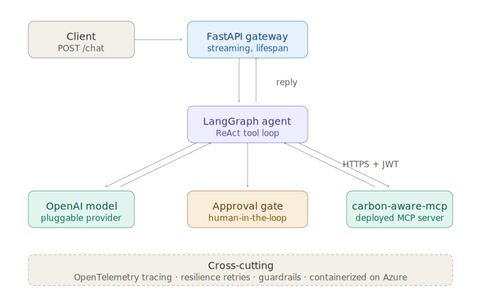

# carbon-aware-agent
v0.1.1

A remote ReAct agent server connected to a [carbon-aware-mcp](https://github.com/michalskimm/carbon-aware-mcp)
server that exposes live UK grid carbon-intensity tools, so the LLM agent can schedule a
workload when the grid has the lowest carbon emissions.

🔗 **Live:** https://carbon-aware-agent.happystone-b5035f44.polandcentral.azurecontainerapps.io

## What it does
Schedules a job of length D over the next N hours so that it runs at the lowest-carbon time,
using the carbon-aware-mcp tools to read live UK grid intensity and forecast data.

```bash
curl -X POST https://carbon-aware-agent.happystone-b5035f44.polandcentral.azurecontainerapps.io/chat \
  -H 'content-type: application/json' \
  -d '{"message": "When should I run a 3-hour job today?"}'
```
```json
{
  "reply": "The greenest time to run your 3-hour job today is from 09:30 to 12:30, when the average carbon intensity is lowest at 76.2 gCO₂/kWh.",
  "thread_id": "f69fd440-d82c-4d4a-8322-d94e0f0b826e",
  "tools_used": ["greenest_window"]
}
```

## Architecture


Client → FastAPI gateway (+ observability middleware) → LangGraph agent → MCP tool loop

- **FastAPI gateway** — separates transport from orchestration. The gateway owns HTTP,
  streaming, request IDs, and the agent lifespan; the agent owns the reasoning.
- **LangGraph ReAct agent** — a state graph that decides whether to call a tool, calls it
  (via MCP), reads the result, and either calls another tool or answers. Production runs 
  the prebuilt ReAct agent; a hand-built StateGraph equivalent is included and tested, 
  so the loop is owned, not opaque.
- **MCP client** — the agent authenticates to the carbon-aware-mcp server with a JWT bearer
  token over streamable HTTP.
- **Checkpointed state** — for pause/resume durability; InMemorySaver here, a durable store
  in production.
- **Streaming responses** — `/chat/stream` over SSE pushes tokens as they are generated, so
  the user sees output immediately — the same perceived-latency win that makes commercial
  chat clients feel fast.
- **Human-in-the-loop** — gates only the irreversible, high-blast-radius action: committing a
  schedule that may trigger a real job. Read-only queries run without interruption.
- **Observability** — structured JSON logs plus OpenTelemetry spans via middleware (logs
  argument keys, never values).
- **Everything async** — the request path is I/O-bound (LLM and tool calls).
- **Resilience** — retries transient MCP transport failures with exponential backoff and a
  timeout; LLM retries are delegated to the provider SDK. The MCP stack wraps connection
  errors in an `ExceptionGroup`, so the retry predicate recurses into the group rather than
  matching on type alone.
- **Testing** — unit tests of individual modules with no external dependencies, plus
  integration tests (agent orchestration, guardrails) that skip cleanly when MCP/LLM config
  is absent.

## Running it
Copy `.env.example` to `.env` and fill in `OPENAI_API_KEY`, `CARBON_MCP_TOKEN`, and
`CARBON_MCP_URL` (the MCP server's `/mcp` endpoint — either a locally running carbon-aware-mcp
or the deployed URL). The app loads `.env` on startup.

```bash
cp .env.example .env          # then fill in real values
uv sync
uv run carbon-agent           # serves on :8001
uv run pytest                 # unit tests run anywhere; integration tests skip without MCP/LLM config
```

`/health` works immediately; `/chat` needs the MCP server reachable at `CARBON_MCP_URL` (if
it isn't, the agent starts but tool calls fail).

## Decision log
- **Separate repo and service from the MCP server** — the MCP server is a reusable tool
  provider (other agents could consume it); the agent is one consumer. They version, scale,
  and deploy independently.
- **Provider-agnostic model factory** — swap OpenAI/Anthropic via `LLM_PROVIDER`; defaults
  live in one place, and config is read inside the factory (not at import) so the module
  stays importable and testable without full environment config.
- **Prebuilt agent in production, hand-built equivalent included** — the gateway runs the 
  supported create_agent; a tested hand-built StateGraph demonstrates the loop is owned, 
  not opaque. Deliberate choice of the supported path for production.
- **HITL on the irreversible action only** — gating every tool call adds unbounded latency;
  gating only the schedule commit bounds risk without slowing read-only queries.
- **Resilience scoped to MCP transport** — the agent retries transport-level MCP failures;
  LLM retries are left to the provider SDK to avoid double-retrying. Keeps the retry layer
  provider-agnostic.
- **OpenTelemetry tracing, agent-service scope** — an `agent.chat` span per request, console
  plus optional OTLP export. Cross-service propagation into the MCP server and per-call
  LLM/tool breakdown are deferred (the latter via LangSmith, which auto-instruments the
  prebuilt agent).
- **Azure Container Apps, scale-to-zero** — chosen for managed HTTPS, ingress, and
  source-to-deploy. Scales to zero (capped at max 1 for this POC) so idle cost is near zero.
  The same container runs anywhere.
- **CI on GitHub** — ruff lint/format and pytest on every push, on a clean checkout (the
  environment that catches import-time configuration bugs).
- **The response reports tools that *executed*, not tools the model *intended*** — `/chat`
  returns a `tools_used` list built from successful `ToolMessage`s, excluding errored ones.
  A planned-but-failed tool call is therefore *not* reported, so a consumer (or an eval) can
  tell when an answer came back ungrounded. Reporting intent instead would mask that failure.

## Guardrails
The `/chat` endpoint is public and unauthenticated by design (a click-to-try demo). Misuse
is bounded by five layers rather than by auth:

1. **Rate limiting** — 5 requests/minute per client IP (slowapi).
2. **Input length cap** — messages capped at 2000 characters, so no single call is expensive.
3. **Spend cap** — a hard $5 ceiling on the LLM account; worst case is bounded loss, not a
   runaway bill.
4. **Bounded blast radius** — the MCP tools are read-only and the one mutating action is
   HITL-gated, so a misbehaving or prompt-injected agent can't delete data, spend money, or
   mutate state.
5. **System-prompt scoping** — off-topic requests are briefly declined and redirected. (A
   soft guardrail — the hard limits are 1–4.)

## Scaling notes
Not built in v0.1 — what production would need:

- **Cache the forecast (short TTL).** Every request currently hits carbon-aware-mcp live,
  the first bottleneck under load. The data only changes every 30 minutes, so a ~5-minute
  cache cuts upstream calls dramatically for free.
- **Per-client rate limiting.** Throttle per token so one client can't exhaust the server or
  the upstream API budget.
- **Circuit breaker and fallback.** Beyond the current retry/backoff, a breaker would stop
  hammering a failing MCP server, with a cached-forecast fallback for degraded operation.
- **Metrics and alerting.** The OTel spans already capture per-tool latency and
  success/failure, so the instrumentation is there; production would add a metrics backend
  (Azure Monitor / Grafana) and alerts on p95 latency and error rate.
